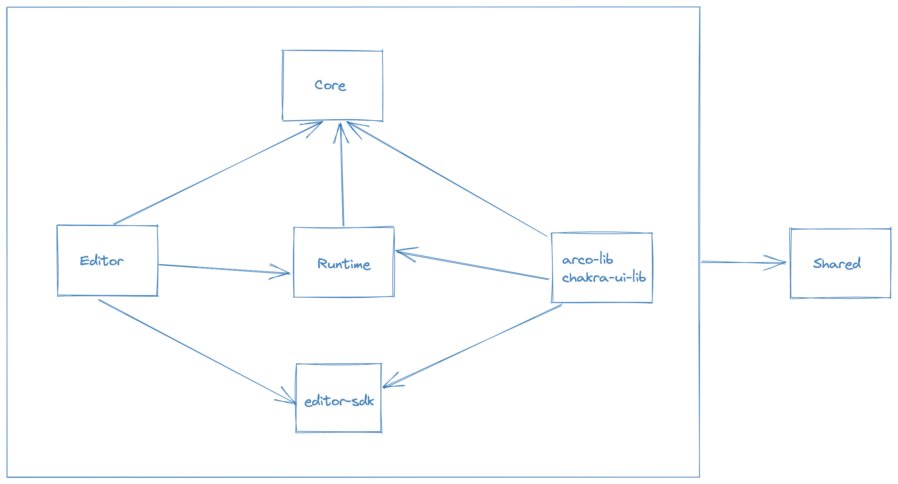

# Directory Structure

Sunmao is a monorepo project that includes the following packages:

| Name          | Description                                                                                 |
| ------------- | ------------------------------------------------------------------------------------------- |
| core          | Spec type definition of Sunmao                                                              |
| runtime       | Sunmao's runtime                                                                            |
| editor        | Sunmao's GUI editor                                                                         |
| editor-sdk    | sdk for Sunmao Editor                                                                       |
| shared        | Types and utility functions shared by each package of the Sunmao project                    |
| chakra-ui-lib | [chakra-ui](https://chakra-ui.com/) component library packaged by Sunmao                    |
| arco-lib      | [arco-design](https://arco.design/) component library packaged by Sunmao (recommend to use) |

