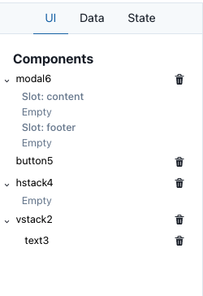
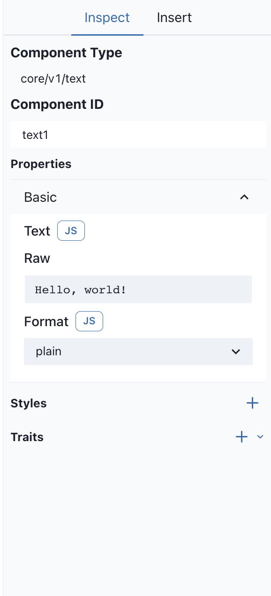
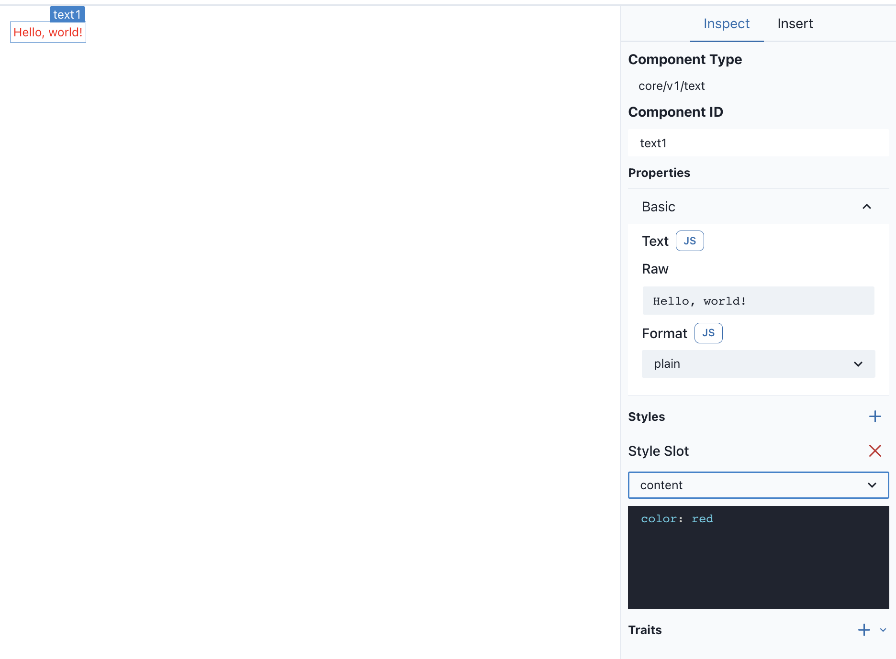
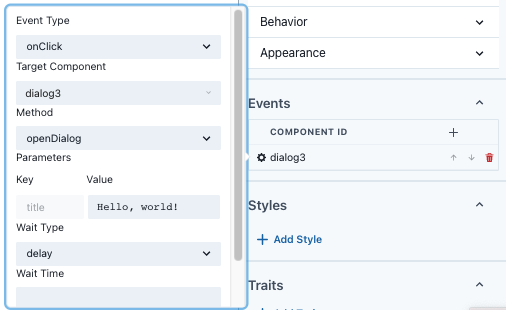

# Sunmao User Tutorials

## Basic concepts

### Application

Application is the biggest concept in Sunmao. An Application is a complete working front-end application.

### Component

Component is the smallest unit in Sunmao that is responsible for rendering UI.

Components are mostly common UI components, such as Button, Input, etc., but can also be custom highly encapsulated business logic components.

We can define the style and behavior of a Component by passing parameters to it.

### DataSource

DataSource is the component that carries data in SunmaoUI. DataSource can be of various types: global state, API request, LocalStorage ......

Essentially, DataSource is a Component, but it does not render the UI, it only fetches data.

### Trait

Trait is a unique Sunmao concept; a Trait can be understood as a feature that a Component has when it is added to a Component. For example, if a **State Trait** is added to a Component, then a state is added to that Component. For another example, if a **Style Trait** is added to a Component, then a custom style is added to the Component.

## Sunmao Development Guide

### How to layout?

Sunmao has a built-in Stack Component called `core/v1/stack`. With this component, you can adjust the spacing, orientation, and alignment of the Component ......

> The Stack layout is essentially a Flex layout.

When using the Stack layout, the order and parent-child relationship between Components are important. Here we will describe how to express the parent-child relationship of Components in Sunmao.

#### Slot

In Sunmao, the parent-child relationship is represented by the Slot.

A Slot is a slot where a Component inserts its child components. Each Slot can insert an unlimited number of child components. A Component can have more than one Slot, so the number of Slots and their names are defined by the Component. Generally, we agree that if a Component has only one Slot, the default name of that Slot is `content`.

In the following example.

`modal6` has two Slots, `content` and `footer`. Neither Slot currently has a Component, so it is rendered as Empty.

`button5` has no Slot, so there is no expanded arrow on the left.

`hstack4` has a Slot, which is `content`. Because it has only one slot, the slot name is omitted from the display.

`vstack2` has a Slot, which currently has a `text3` Component.

### How do I configure parameters for a component?

First, select a component in the canvas or in the left column, then the right column will show the component's parameter form.

If you need to enter complex logic or use the state of another Component, you'll need to use expressions.

#### expressions

For example, you want to decide whether to disable a button based on the value of an Input. Then, you need to set the `disabled` value of the button to `{{input.value ! == ''}}`. This is an expression. Where `input` is the ID of the object you want to access, and you must use the correct ID to access the object. `value` is the state exposed by Input.

The expression is a string enclosed by `{{ }}`. This string can be any legal Javascript code. Expressions support nesting and splicing with normal strings.

For more expression usage, please refer to: [Expression Expression Design](. /expression.md).

> For non-input controls on the form, you can switch this space to input by clicking the JS button next to the control, and then you can enter the expression.

### How do you manage data?

An application needs data in addition to UI. In Sunmao, the logic of data is generally managed by DataSource. sunmao has some common DataSource built in, such as State, LocalStorage, API and so on.

In the expression, you can access the value of the DataSource just like a normal Component.

| DataSource | Usage |
| ------------ | -------------------------- |
| state | Add global state |
| localStorage | Save data to localStorage |
| API | Sending HTTP requests |

### How do I modify the style?

To modify the style, you need to click the "+" button on the right side of the Style in the Component's form.

Then select the Style Slot you want to add style to, which is the HTML element you want to modify the style.

Finally, enter the CSS code in the black field and the style will take effect on the Component.

### How do I listen to the component's events?

Each Component has its own Event and Method; Event is the event that the Component will trigger, and Method is the behavior that the Component can be called on. For example, when a Button is clicked, it opens a Dialog, which requires the Button to emit an `onlick` Event and the Dialog to have an `openDialog ` Method.

#### Event Handler

To listen for an Event, you must add an Event Handler to the Component that emits the Event.

The Event Handler has these elements.

- The Event it is listening to
- The id of the calling Component
- The Method of the calling Component
- The parameters passed when the Method is called
- Some other configurations

> Multiple Event Handlers can be added to a Component.

The following is an example showing how to open a Dialog when a Button is clicked.

