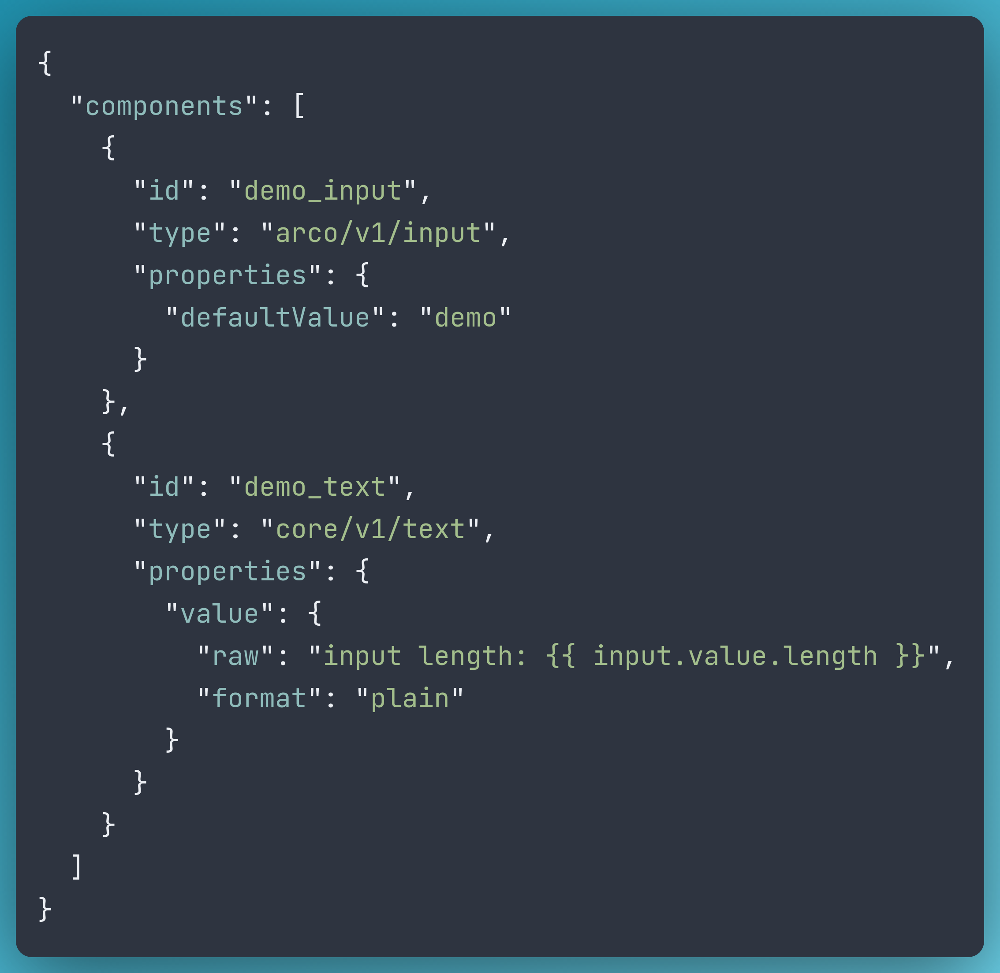
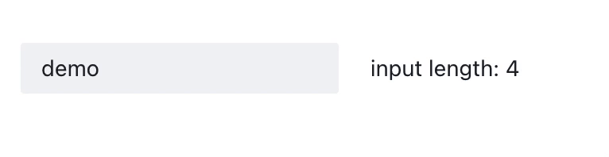
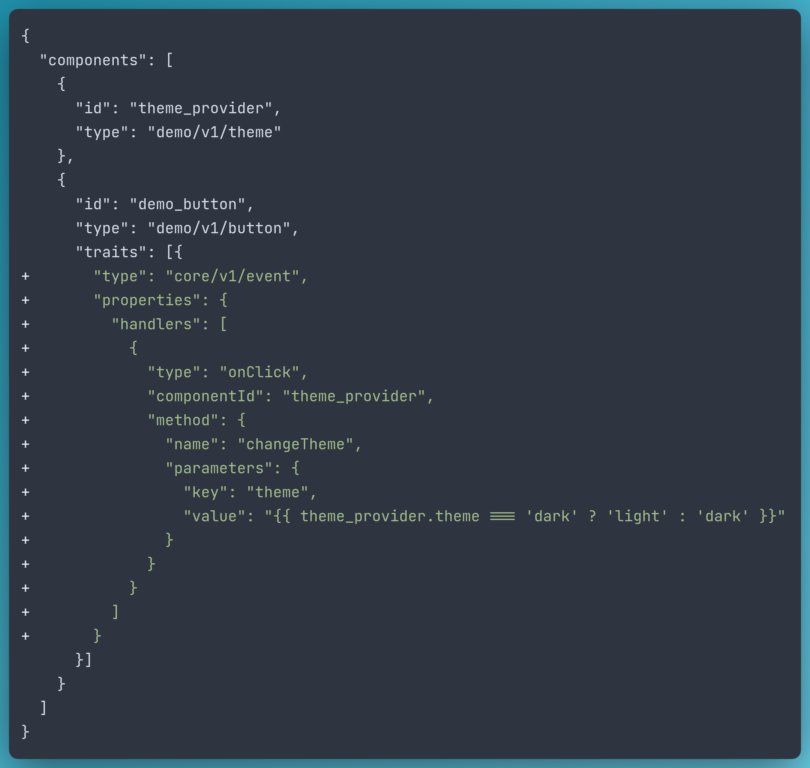
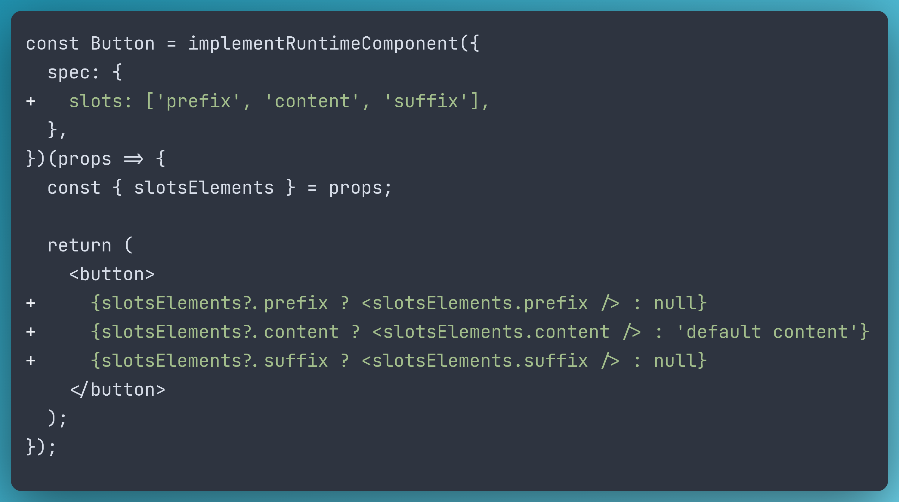
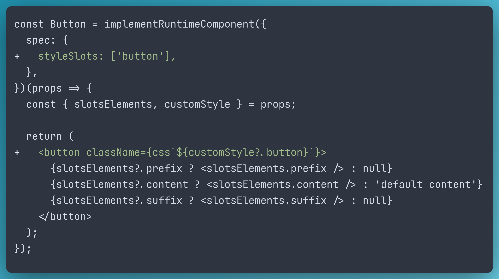
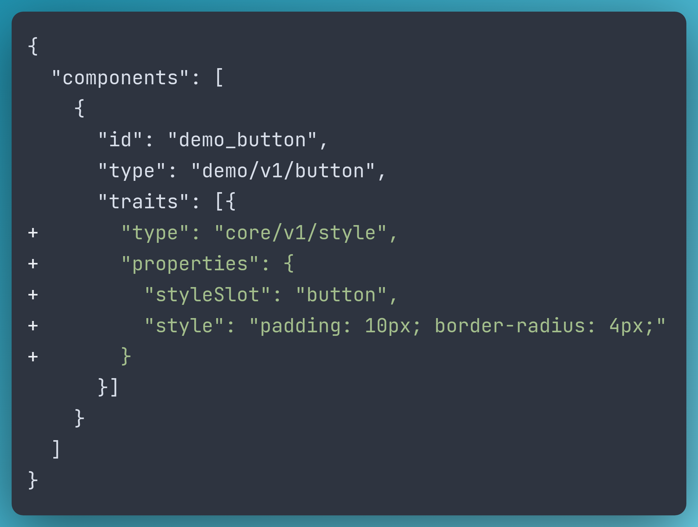
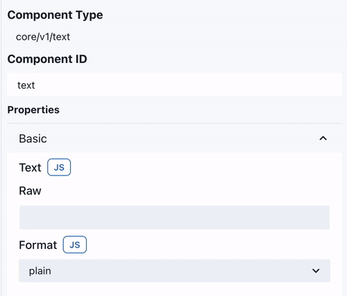

# Sunmao: A truly extensible low-code UI framework

Although more and more people are becoming interested in low-code development, they still have some reservations.

The most common concerns about low-code are a lack of flexibility and vendor lock-in.

That is reasonable because no user wants to be told that they cannot implement certain features in their application or that they must rewrite the application when moving it off of a vendor's platform.

Some products, wisely, limit the use of low-code to specific areas, such as internal tools and landing pages, where users value productivity over flexibility. It works until developers want to boost their productivity in more general scenarios.

That's why we started working on Sunmao, an open-source low-code UI framework with a focus on extensibility.

## Design principles

Sunmao is a Chinese phrase '榫卯' that refers to one of the oldest and most durable wooden architectural techniques used in Chinese history. We love this name because it represents how we put together building blocks and make solid applications in Sunmao.

Several design principles are followed while developing Sunmao to ensure proper abstraction.

### 1. Clarify the jobs of different roles

Sunmao's aha moment came when we learned that persons who develop applications are normally separated into two groups: component developers and application builders.

Component developers are concerned with code quality, performance, and user experience when creating reusable components. After creating a component in their favourite way, they can wrap it as a Sunmao component and register it to the platform.

Application builders pick reusable components and incorporate business logic into them. They can complete this task quickly and effectively in Sunmao with much less code.

Applications are made every hour, but components are created significantly less frequently. With sunmao-roles ui's division, users may delegate component creation to senior frontend developers while junior frontend developers, backend developers, and even non-coders build and iterate apps.

### 2. Leverage the power of coding, not limit

As previously stated, Sunmao will not compel users to create applications only with simple components like buttons and inputs. Instead, component developers may register sophisticated, domain-specific components that meet your requirements and follow your design system.

We also put a lot of effort to ensure that Sunmao's implementation does not impose any limit on users. For example, many low-code tools' GUI editors offer highlight when you hover over or select a component. Some of them implement this by wrapping the component with a `
` element and styling it.

However, this is unsatisfactory for Sunmao because it increases the number of DOM nodes, changes the hirarchy of DOM nodes, and prevents components from having inline layout.

Although It took us longer to develop a solution that overcames all of the drawbacks, but we believe it was worthwhile because it does not limit the power of coding.

### 3. Extensible in every aspect

Sunmao contains three layers: the core spec, the runtime, and the editor.

The schema of a component or an application is described in the core spec. Aside from the usual fields, users can add annotations and use them later in the runtime or editor.

We've already discussed how components functions for the runtime, and all of them are customizable. Later on, we'll talk about trait, which is another approach to expand the runtime.

Users can also change how a component's property is inputted and displayed in the editor.

### 4. Concentration rather than divergence

Instead of creating a full-stack low-code solution, we concentrate on the UI part, and Sunmao is currently just available on the web.

Since we believe that backend technologies are fast improving these days ,creating a UI-only solution that can be utilized with any type of backend service would provide our users with the most flexibility.

## How does it work

We believe that web UI development is already quite mature, and Sunmao just adds a few necessary primitives for the low-code scenario, namely:

- reactive
- events and methods
- slots and style slots
- types
- traits
- GUI editor

### Respond to the latest state

Reactive means when a state changes, all the UIs that depend on it will re-render automatically. Sunmao creates a performant, reactive state store in which all components expose their state and can access the state of others.

For example, we can access demo input's value state in the demo text component:

And it just work!

### Connect the components

Modern UI frameworks emphasize state-driven and declarative concepts, which are not friendly to the low-code scenario.

If you want to switch to the dark theme when you click the theme button, all you need is an `onClick` event and a `changeTheme` method.

Sunmao's spec lets every component declare the events they will dispatch and a set of immersive methods for interacting with itself from any other components.

To add an event handler as follows:

### Layout and style

When we develop an application, we usually end up with a hierarchical structure of components, such as a DOM tree.

Sunmao's schema on the other hand, is straightforward to store and modify because we utilize an array to contain all the components without nesting. As a result, we introduce slots to aid in the organization of the hierarchy.

To declare and implement slots in a component as follows:

To insert a component into a slot of another component:

Another fascinating aspect is customizing the style of a component. If component developers can offer the ability to style a component, it will dramatically increase reusability.

That is why style slots were created. It enables the application builder to pass CSS styles to components.

To declare and implement style slots in a component as follows:

To insert customized styles to a style slot:

### Live in a type-safe world

We at Sunmao feel that type-safe will increase DX and efficiency for component developers as well as application builders. As a result, typescript and JSON schema are heavily used in our implementation.

If you use typescript to create a component, we will infer types from the JSON schema, which will help you write safe code.

Our type system also provides auto-complete and validation features for application builders.

### Ability sharing across components

The word 'trait' appears in the application schema in the previous examples. That is how we share common abilities across components, such as fetching data and throttling events.

We believe that providing props like `dataUrl`, `hidden`, or `handlers` to every component is redundant. The trait system is a good abstraction for keeping component implementation clean and simple.

### A extensible GUI editor

Sunmao's GUI editor will read all of the components' specs and generate a form based on its JSON schema description.

If some of the form widgets require extensive customization, component developers can implement their own widgets and allow specific components to use them. A detailed design of the customized widgets can be found [here](https://github.com/smartxworks/sunmao-ui/issues/313).

## Sunmao is open

Sunmao is an open-source project from day 1. But when we say 'open,' we don't just mean open-sourcing the code under the Apache-2.0 license.

Although Sunmao starts as an internal project from SmartX, we chose to place all the proposals, discussions, and design decisions into our public repo rather than any internal channels. Because we believe that 'be open' is the cornerstone of Sunmao, and that this project will shine as more developers construct their own low-code solution on top of Sunmao.

If you're interested in Sunmao, please visit our Github repository and join the slack channel to stay connected with the community.
