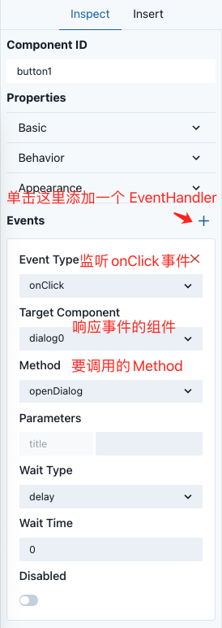

# Sunmao 使用者教程

## 基本概念

### Application

Application 是 Sunmao 中最大的概念。一个 Application 就是一个可以运行的 Sunmao 应用。

### Component

Component 是 Sunmao 中负责渲染 UI 的最小单位。

Component 大多是常见的 UI 组件，例如 Button、Input 等等，也可以是一些特制的高度封装的业务逻辑组件。

我们可以给通过给 Component 传递参数，来定义 Component 的表现、样式和行为。

### DataSource

每个应用都少不了数据，DataSource 就是 SunmaoUI 中承载数据的组件。DataSource 可以有多种类型：全局状态、API 请求、LocalStorage……

它本质上也是 Component，只不过它不会渲染 UI，只负责获取数据。

### Trait

Trait 是 Sunmao 的特殊概念。Trait 可以理解为一种特性，当 Trait 被添加到一个 Component 上时，这个 Component 就具备了这种特性。例如，如果给一个 Component 添加 State Trait，那么这个 Component 上就会被添加一个状态。又比如，如果给一个 Component 添加 Style Trait，那么这个 Component 就会被添加上自定义的样式。

# Sunmao 开发指南

### 如何布局？

在 Sunmao 中，我们推荐使用 Stack 来布局。Sunmao 已经内置了一个 Stack Component ，名字叫做 `core/v1/stack`。通过这个组件，您可以调整 Component 的间距、方向、对齐……

> Stack 布局本质上就是 Flex 布局。

使用 Stack 布局时，Component 之间的顺序和父子关系十分重要。下面我们就来介绍在 Sunmao 中如何表达 Component 的父子关系。

#### Slot

在 Sunmao 中，父子关系是通过 Slot 体现的。

Slot 是 Component 插入子组件的插槽。每个 Slot 都可以插入无限个子组件。一个 Component 可以拥有多个 Slot，所以 Slot 的数量和名字都是由 Component 自己定义的。通常，我们约定如果一个 Component 如果只有一个 Slot，这个 Slot 默认名叫 `content`。

在下面这个例子中：

modal6 拥有两个 Slot，分别是`content` 和`footer` 。两个 Slot 目前都没有 Component，所以呈现为 Empty。

button5 没有 Slot，所以没有左边的展开的箭头。

hstack4 有一个 Slot，是`content` 。因为它只有一个 slot，所以显示的时候省略了 slot 名称。

vstack2 有一个 Slot，其中目前有一个 text3Component。

### 如何给组件配置参数？

首先，在画布或者左侧栏中选中一个组件，然后右侧栏就会展示组件的参数表单。

如果你需要输入复杂的逻辑或者使用别的 Component 的状态，就需要使用到表达式了。

#### 表达式

例如，您想根据一个 Input 的 value 值，来决定是否禁用一个 button 按钮。那么，您需要把 button 的 `disabled` 值设置为`{{input.value !== ''}}`。这就是一个表达式。其中，`input`是您要访问的对象的 ID，必须使用正确的 ID 才能访问到对象。`value`是 Input 暴露的状态。

表达式是由 `{{ }}` 包围的字符串。这个字符串可以是任何合法的 Javascript 代码。表达式支持嵌套、与普通字符串拼接。

更多表达式用法，请参考：[Expression 表达式设计](./expression.md)。也可以参考，[Javascript in Retool](https://docs.retool.com/docs/javascript-in-retool)。虽然这是 Retool 的文档，但是这部分内容跟 Sunmao 基本通用。

> 对于表单中非 input 的控件，你可以通过点击控件旁边的 JS 按钮，把这个空间切换成 input，然后就可以输入表达式了。

### 如何管理数据？

一个应用除了需要 UI ，还需要数据。在 Sunmao 中，数据的逻辑一般由 DataSource 来管理。Sunmao 内置了一些常用的 DataSource，例如 State，LocalStorage，API 等等。

在表达式中，你可以像访问普通 Component 那样访问 DataSource 的值。

| DataSource   | 用途                       |
| ------------ | -------------------------- |
| state        | 添加全局状态               |
| localStorage | 保存数据到 localStorage 中 |
| API          | 发送 HTTP 请求             |

### 如何修改样式？

修改样式需要在 Component 的表单中，点击 Style 右侧的 "+" 按钮。

然后选择要添加样式的 Style Slot，也就是需要修改样式的 HTML 元素。Style Slot 的种类是由 Component 开发者决定的。

最后在黑色区域输入 CSS 代码，样式就会在 Component 上生效了。

### 如何监听组件的事件？

每个 Component 都有自己的 Event 和 Method。Event 是这个 Component 会触发的事件，Method 是这个 Component 可以被调用的行为。举个例子，当一个 Button 被点击的时候，打开一个 Dialog。这就需要 Button 能够发出一个`onlick` 的 Event，并且 Dialog 上有一个`openDialog ` 的 Method。

#### Event Handler

要想监听一个 Event，则必须在发出 Event 的 Component 上面添加一个 Event Handler。

Event Handler 有这些要素：

- 监听的 Event
- 调用的 Component 的 id
- 调用的 Component 的 Method
- 调用 Method 时传递的参数
- 其他一些配置

> 一个 Component 上可以添加多个 Event Handler。

下面就是一个例子，展示了如何在点击 Button 时，打开 Dialog。

